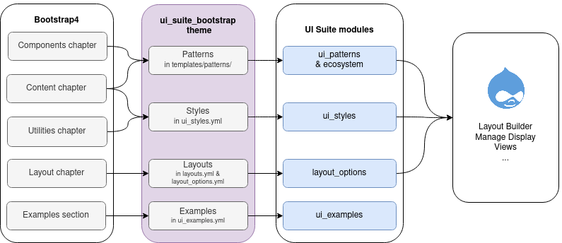

# UI Examples

OVERVIEW
------------

This module allows developers to provide example pages from modules or themes by defining render arrays in a YML files.

Examples library is located at `/examples`

Each example page is a plugin, declared like that:

```yaml
album:
  label: Bootstrap Album
  description: Simple one-page template for photo galleries, portfolios, and more.
  render:
    ...
```

Where:

* `album` is the plugin ID. The page path is built from the plugin ID.
* 'label' is used in the library
* 'description' is used in the library
* 'render' is the render array to render on the example page


RECOMMENDED MODULES
------------

[ui\_suite\_bootstrap](https://github.com/pdureau/ui_suite_bootstrap) is an example of a site-building friendly Drupal theme using [UI Examples](https://www.drupal.org/project/ui_examples)  with [UI Patterns](https://www.drupal.org/project/ui_patterns), [Layout Options](https://www.drupal.org/project/layout_options) and [UI Styles](https://www.drupal.org/project/ui_styles) modules, to implements [Bootstrap](https://getbootstrap.com/) 4:




INSTALLATION
------------

Install as you would normally install a contributed Drupal module. Visit
   https://www.drupal.org/node/1897420 for further information.


CONFIGURATION
-------------

The module has no modifiable settings.
